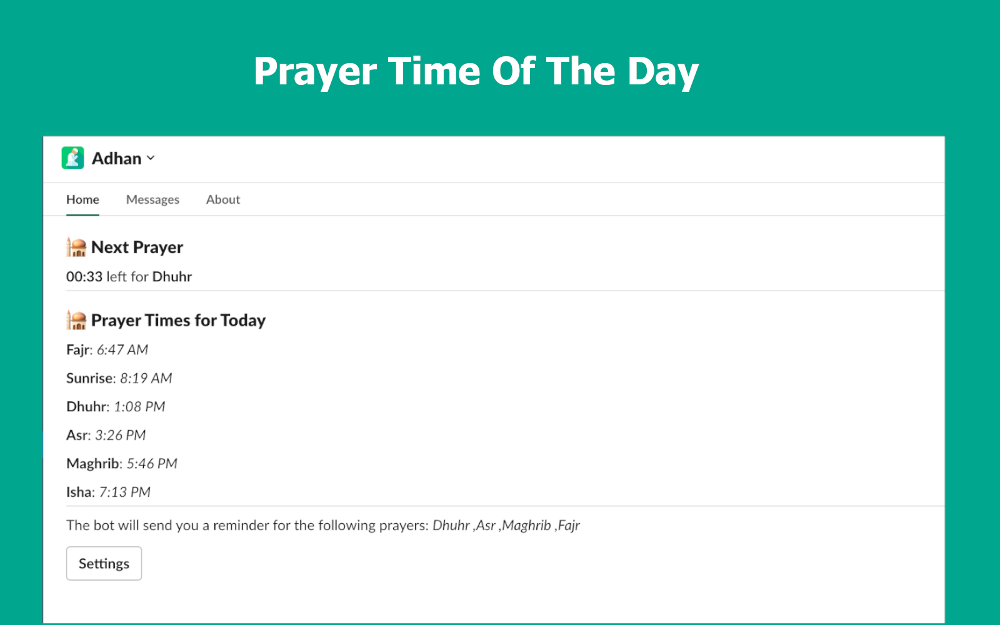
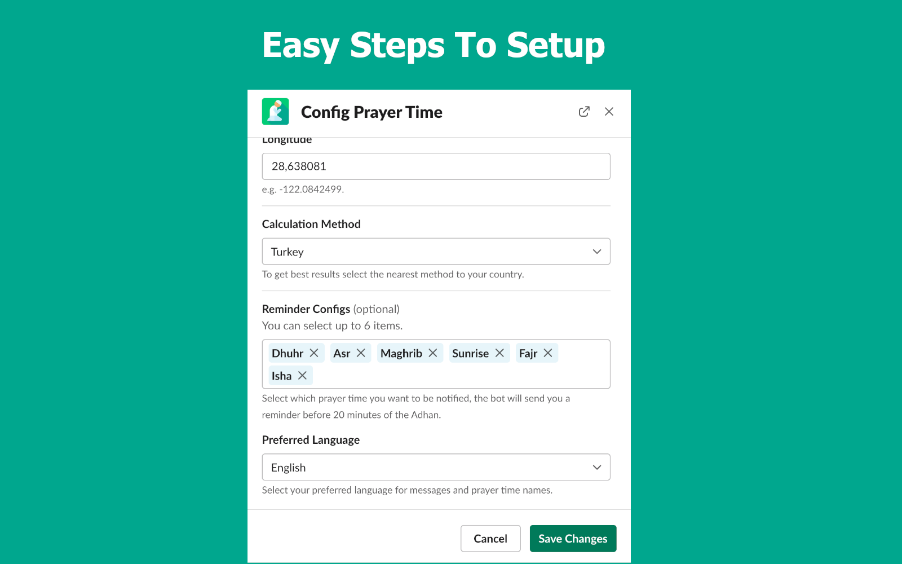
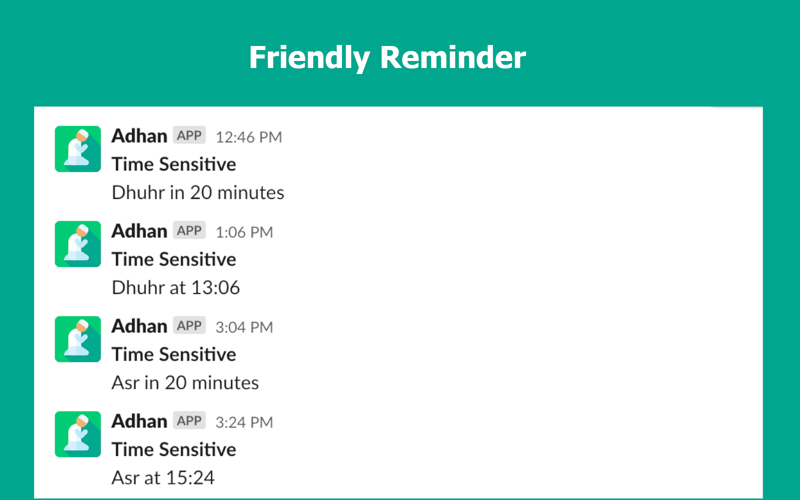

## Adhan Slack App

Adhan Slack App is an Islamic prayer times reminder configurable and sample to use, the App job is to help you remember praying before the next prayer time by sending a friendly notification.

</img>
</img>
</img>

## Features

- On-time and easy configuration
- High precision Islamic prayer time
- Support different calculation methods
  - `Muslim World League`
  - `Egyptian General Authority of Survey`
  - `University of Islamic Sciences, Karachi`
  - `Umm al-Qura University, Makkah`
  - `Islamic Society of North America (ISNA)`
  - `Dubai`
  - `Kuwait`
  - `Qatar`
  - `Singapore`
  - `Tehran`
  - `Turkey`
- Support Arabic and English for the text of prayer time names and reminder messages.
- Disable/Enable reminders on specific prayer times

## Project Structure

The project base on [boltjs](https://slack.dev/bolt-js/tutorial/getting-started) which is a expressJs wrapper with slack helper functions.
The project split into two main parts in other word two functions as I deployed as two lambda functions:

- Part #1 handler
  - this handler is the main application will run and listen to any event from `slack` and handle it like `app_home_opened` event
- Part #2 background job
  - this part do a full scan in the database each half an hours and fetch all the users match the time at `01:00` depending on the user timezone and then schedule reminder messages for the whole day (check this [article](https://nurdin.dev/schedule-a-job-at-the-same-time-in-different-timezones) for more details about this approach)

## Development

- In order to run this application locally you most create a slack app and use the template in [manifest.yml](manifest.yml) **the links will be replace it after run the code locally**
- Install the slack application you have created in your workspace
- Clone the repo:
  - `git clone git@github.com:NurdinDev/Adhan-Slack-App.git`
- Go to the cloned directory:
  - `cd Adhan-Slack-App`
- Create `.env` file:
  - `mv evn.example .env`
- Copy the `SLACK_CLIENT_ID`, `SLACK_CLIENT_SECRET` and `SLACK_SIGNING_SECRET` from the slack app directory you have created and paste it in the `.env` file
- Run mongodb in your local if you prefer docker you can run
  - (optionally) `docker compose up -d mongodb`
- Install dependencies:
  - `yarn install`
- Start the project
  - `yarn start:dev`
  - then an express app will run at port `3000`
- Because slack just accept `https` we have to run our `localhost:3000` on `https`, I use `ngrok` for this scenario
  - `ngrok http 3000`
- Copy the `https` link and replace `redirect_urls` and `request_url` host url **before `/slack`**
  with your local url in you slack application

## Deployment

I use serverless framework to deploy to aws lambda and setup ApiGateway with CloudWatch scheduler to run the background function.

## Contributing

I started this project in the seek of learning and trying out SlackAPI, the project is useful for some people and I love open source which is making me decide to open source this project and open it to anyone who needs to contribute and add feature or fix a bug.

## TODO

- [ ] - Refactoring and use logger instead of console.logs
- [ ] - Support Turkish language

## License

The MIT License.
